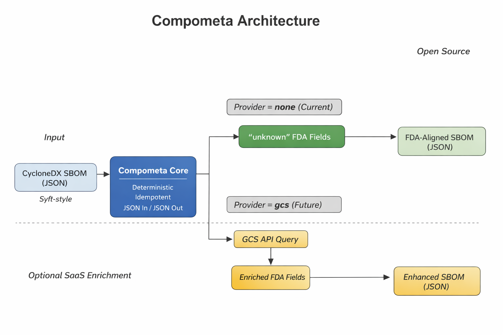

# Compometa Architecture

This document explains Compometa’s architecture, boundaries, and provider model.

## Diagram

---

## Summary

Compometa is a **deterministic, idempotent CycloneDX JSON transformer** that ensures two FDA-expected supportability fields exist **for every component**.

Compometa is intentionally split into:

1. **Open-source core (this repo):** repeatable transformation + contracts + tests
2. **Optional enrichment provider (external):** authoritative lifecycle metadata, delivered behind a provider interface

This split is the business and engineering boundary.

---

## Core Data Flow

**Input:** CycloneDX JSON SBOM (expected: Syft-shaped per contract)  
**Output:** CycloneDX JSON SBOM (same format), with FDA fields guaranteed

Pipeline:

1. Parse CycloneDX JSON
2. Traverse components (top-level + nested defensively)
3. Inject FDA supportability keys (if missing)
4. Normalize deterministically (stable ordering)
5. Emit JSON with stable serialization

---

## Provider Model

Compometa supports a provider mode to control how values are populated.

### Provider = `none` (current milestone, open-source)

- Compometa **always injects**:
  - `softwareMaintenanceStatus`
  - `softwareEndOfLifeDate`
- Values default to `"unknown"` when no authoritative value is available.
- If a component already contains these fields, Compometa **does not overwrite** them.
- No network calls. No secrets. No external dependencies.

This mode is the **baseline FDA-aligned SBOM completion** path.

### Provider = `gcs` (future, optional)

- Compometa becomes a **client** to an external provider endpoint.
- The provider returns values for the two FDA fields:
  - Authoritative values when determinable
  - `"unknown"` when not determinable
- The provider is treated as a **black box** from the OSS perspective:
  - Compometa does not embed enrichment heuristics
  - Compometa does not disclose provider logic or data sources

This mode is the **optional enrichment** path.

---

## Determinism Boundary

Compometa guarantees determinism and idempotence **at the transformer boundary**.

### What Compometa guarantees

For identical input SBOM + identical provider selection + stable provider data:

- Stable output structure
- Stable component ordering
- No regenerated UUIDs
- No timestamps added
- Idempotent reruns (output stabilizes)

### What Compometa does *not* guarantee

If provider-backed enrichment is enabled, determinism depends on **provider data stability**. Compometa will still:
- preserve stable serialization and ordering
- avoid generating new identifiers/timestamps
- treat provider results as input data

---

## Ownership Split

### Open-source core owns

- CycloneDX JSON ingestion and emission
- Component traversal (including defensive nested handling)
- Field injection rules
- Deterministic normalization rules
- Golden test harness and fixtures
- Public documentation and contracts

### Provider (external) owns

- Data sourcing, reconciliation, and provenance
- Human-in-the-loop validation (if applicable)
- Caching, rate limiting, and operational controls
- Authentication, authorization, billing (if applicable)
- Any claims of “authoritative” lifecycle metadata

Compometa’s OSS posture is intentionally conservative: **it guarantees presence of fields** and defaults to `"unknown"` absent authority.

---

## Contract Links

- CycloneDX contract: `../cyclonedx-contract.md`
- Repository README: `../../README.md`
